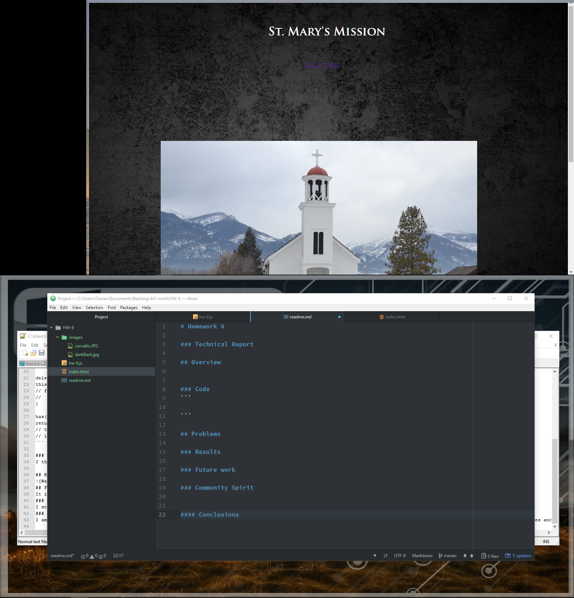
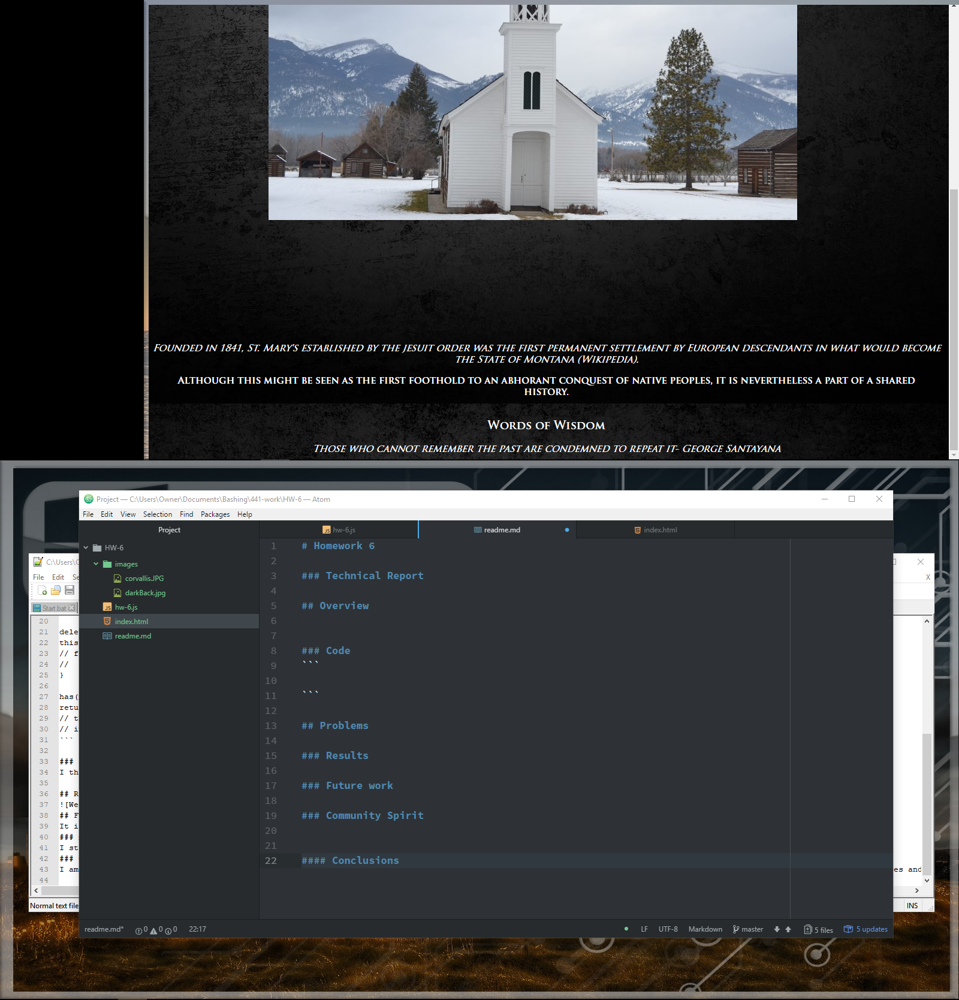

# Homework 6
[Live Site](https://jonswallow.github.io/441Again/)
---
[Repository](https://github.com/JonSwallow/441Again)
### Technical Report

## Overview
Another week I could not center my graphic or my link the way I wanted. I beleive this is because there is a limitation in editing this way. No one has tried to solve it because it was always easier to do something like that in CSS or HTML.

### Code
```
elChild5.innerText="Those who cannot remember the past are condemned to repeat it- George Santayana"
elChild6.innerText="Click Here";
elChild.setAttribute("style","padding:2em; margin:0; text-align:center; color:#fcffd7");
elChild2.setAttribute("style","padding:0em; margin:0; font-style:italic; text-align:center; color:#fcffd7");
elChild3.setAttribute("style","padding:1em; margin:0;  font-weight:bold;  text-align:center; color:#fcffd7");
elChild4.setAttribute("style","padding:1em; margin:0;  font-weight:bold;  text-align:center; color:#fcffd7");
elChild5.setAttribute("style","padding:0em; margin:0;  font-style:italic;  text-align:center; color:#fcffd7");
elChild6.setAttribute("style","padding:0em; margin:600px");
elChild6.setAttribute("href","http://www.saintmarysmission.org/");

myImage.setAttribute("style","padding:0em; margin:200px");

el.appendChild(elChild);
el.appendChild(elChild6);
el.appendChild(myImage);

el.appendChild(elChild2);
el.appendChild(elChild3);
el.appendChild(elChild4);
el.appendChild(elChild5);

body.appendChild(el);
```

## Problems
Well I very well might not have gotten this done withoug Dr. Musicks help.
### Results



### Future work
We shall see.
### Community Spirit
We keep trying. Still have the Discord thing aobut 5 of us involved.

#### Conclusions

When aggrivated by coding; stop, breathe and look for a solution.
(test)
